# Report showing results of training experiments with Unknow class.
This file will show you the model training graphs, `accuracy`, `precision`, `recall`, and `f1-score` tables. 

**Dataset and Unknow Class:**
The dataset `KWS` we have is getting audios from two different sources and can create two datasets with the `twenty classes(KWS 20)` and `thirty-five classes KWS 35` datasets. We are using the `KWS 20` dataset with `20` classes of labels `[up, down, left, right, stop, go, yes, no, on, off, one, two, three, four, five, six, seven, eight, nine, zero],` and a class with `unknown` label. Any audio labeled not in the above mentioned labels will move to the `unknown` class.

According to docs in the `datasets/kws20.py` file,  

> The dataset originally includes `30 keywords`. A dataset is formed with 7 or 21 classes which includes 6 or 20 of the original keywords and the rest of the dataset is used to form the last class, i.e class of the `unknowns`. To further improve the detection of `unknown words`, the `librispeech` dataset is also downloaded and converted to 1 second segments to be used as unknowns as well.

In summary, all the audios that are not labeled are moved to the unknown class.

```python
dataset = [
{
    ...,

    'name': 'KWS_20',  # 20 keywords
    'input': (128, 128),
    'Output': ('up', 'down', 'left', 'right', 'stop', 'go', 'yes', 'no', 'on', 'off', 'one',
                'two', 'three', 'four', 'five', 'six', 'seven', 'eight', 'nine', 'zero',
                'UNKNOWN'),
    'weight': (1, 1, 1, 1, 1, 1, 1, 1, 1, 1, 1, 1, 1, 1, 1, 1, 1, 1, 1, 1, 0.07), # the last element is giving weights to the unknown class.
    'loader': KWS_20_get_datasets,
    },
    ...
]
```
I will explain what effects does unknown class has on accuracy and how can we resolve it.
I ran three experiments with different weights to the unknown class, i.e., `0`, `1`, or `default 0.07`.

## Experiment 1:
In this, I set the weightage to the unknown class to default `0.07`. Our accuracy of classes with unknown classes is `93%`, and by ignoring the `unknown` class is `98%`.:  

**Validation Top 1 Accuracy**
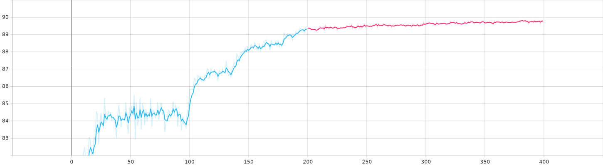

**Validation Loss**
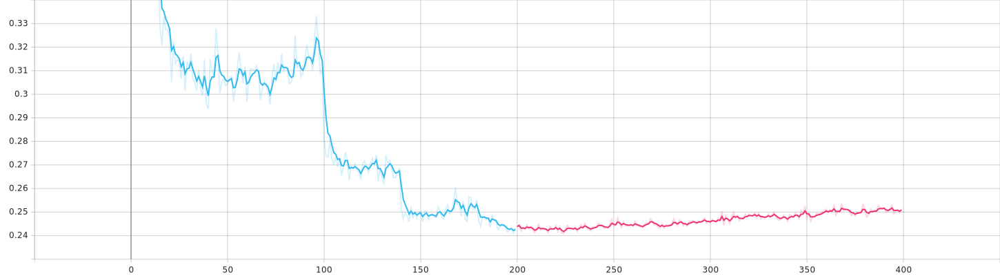


**Training Top 1 Accuracy**
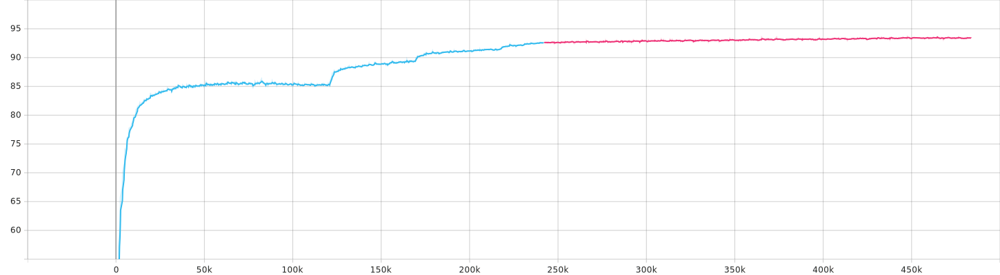


**Training Loss**
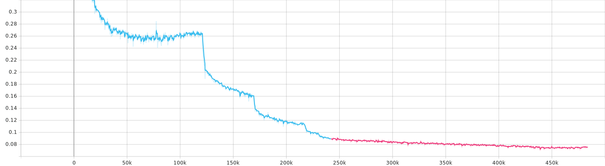

**Training Learning Rate**
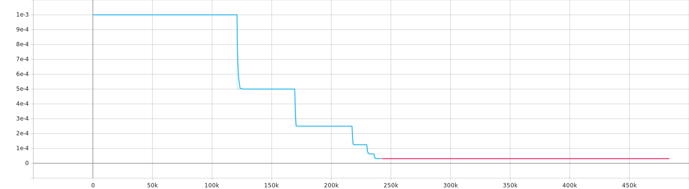

### Accuracy Table on Testing Dataset without early stopping:
This table shows `Accuracy,` `Precision`, `Recall`, and `F1-Score` of the best training experiment with default values provided by the Code owners.


|classes                         |precisions_with_unknown|recall_with_unknown|f1 score with unknown|precisions_ignoring_unknown|recall_ignoring_unknown|f1 score ignoring unknown|
|--------------------------------|-----------------------|-------------------|---------------------|--------------------------|----------------------|------------------------|
|up                              |0.91411                |0.97659            |0.93403              |0.98119                   |0.98303               |0.9818                  |
|down                            |0.88231                |0.98286            |0.91346              |0.99307                   |0.98624               |0.99079                 |
|left                            |0.90575                |0.98103            |0.92953              |0.98997                   |0.98817               |0.98937                 |
|right                           |0.93499                |0.98203            |0.95016              |0.99635                   |0.98203               |0.99153                 |
|stop                            |0.93295                |0.98277            |0.94899              |0.98447                   |0.98362               |0.98419                 |
|go                              |0.90184                |0.98346            |0.9275               |0.9869                    |0.98604               |0.98661                 |
|yes                             |0.93886                |0.98982            |0.95525              |0.99235                   |0.9915                |0.99207                 |
|no                              |0.93191                |0.97855            |0.94696              |0.98916                   |0.9803                |0.98619                 |
|on                              |0.92451                |0.9767             |0.94128              |0.97321                   |0.97846               |0.97496                 |
|off                             |0.90339                |0.98029            |0.92764              |0.96218                   |0.98117               |0.96843                 |
|one                             |0.90579                |0.97945            |0.92908              |0.99006                   |0.98561               |0.98857                 |
|two                             |0.91865                |0.99254            |0.94203              |0.98195                   |0.99254               |0.98546                 |
|three                           |0.8208                 |0.98408            |0.86885              |0.97375                   |0.9867                |0.97803                 |
|four                            |0.80355                |0.98095            |0.85509              |0.98779                   |0.98265               |0.98607                 |
|five                            |0.91489                |0.98223            |0.93629              |0.9839                    |0.98307               |0.98362                 |
|six                             |0.93017                |0.98539            |0.94788              |0.99447                   |0.98539               |0.99142                 |
|seven                           |0.90756                |0.98775            |0.9328               |0.99471                   |0.99122               |0.99355                 |
|eight                           |0.9458                 |0.98543            |0.95865              |0.99266                   |0.98813               |0.99115                 |
|nine                            |0.90085                |0.99147            |0.92916              |0.98476                   |0.99147               |0.98699                 |
|zero                            |0.87665                |0.98863            |0.91105              |0.9869                    |0.99036               |0.98805                 |
|UNKNOWN                         |0.99593                |0.85938            |0.94583              |                          |                      |                        |
|     **Mean**                   |0.90911                |0.97769            |0.93007              |0.98599                   |0.98589               |0.98594                 |
|overall accuracy with unknown   |0.93468126             |                   |                     |                          |                      |                        |
|overall accuracy ignoring unknown|0.9859397              |                   |                     |                          |                      |                        |


In the above table, the last row tells the Mean of columns.
Our accuracy of classes with unknown classes is `93%`, and by ignoring the `unknown` class is `98%`.  

```
=> Checkpoint contents:
+----------------------+-------------+----------------+
| Key                  | Type        | Value          |
|----------------------+-------------+----------------|
| arch                 | str         | ai85kws20netv3 |
| compression_sched    | dict        |                |
| epoch                | int         | 399            |
| extras               | dict        |                |
| optimizer_state_dict | dict        |                |
| optimizer_type       | type        | Adam           |
| state_dict           | OrderedDict |                |
+----------------------+-------------+----------------+

 => Checkpoint['extras'] contents:
+--------------+--------+----------+
| Key          | Type   |    Value |
|--------------+--------+----------|
| best_epoch   | int    | 384      |
| best_mAP     | int    |   0      |
| best_top1    | float  |  89.8359 |
| current_mAP  | int    |   0      |
| current_top1 | float  |  89.7981 |
+--------------+--------+----------+
```

## Test Dataset Confusion Matrix:  


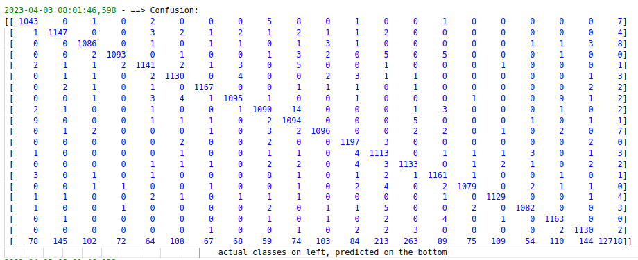


### OverFitting.

As we can see from the `validation loss graph` that after `260 epochs` the `validation loss` is increasing becuase the training loss is expected to decrease as the model is trained, since the model is learning to fit the training data better. However, the validation loss may sometimes reduce. This is because the model may start to memorize and overfit the training data, which means it will not generalize well to unseen data. When this happens, the validation loss will increase, even though the training loss is still decreasing. In summary, reducing validation loss and increasing after some epochs is a sign of overfitting. You can use a bigger validation dataset or techniques such as early stopping to avoid overfitting.

**Resolving Overfitting**
To test early stopping, I evaluated the best model (as experiment 1 in the report) at `epoch 260` (where validation loss increases). I got an accuracy of `93.14313114%` with unknown class and `98.527856` ignoring unknown class (will describe this unknown in the following answer), it means it had less than a `.5%` decrease as to accuracy for `experiment 1`.


## Experiment 2:
In this, I set the weightage to the unknown class to `1`:

**Validation Top 1 Accuracy**
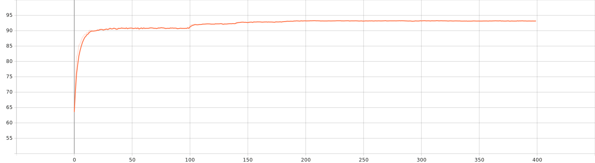

**Validation Loss**
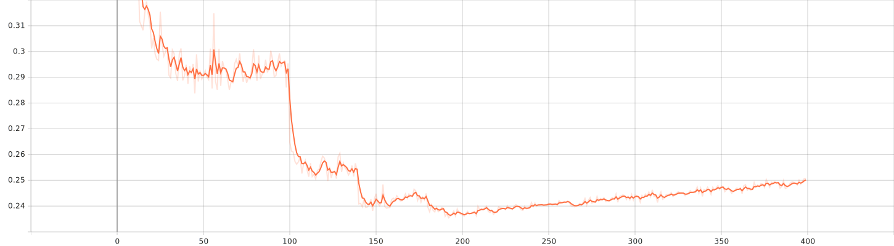


**Training Top 1 Accuracy**
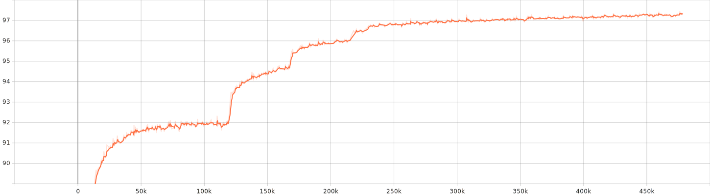


**Training Loss**
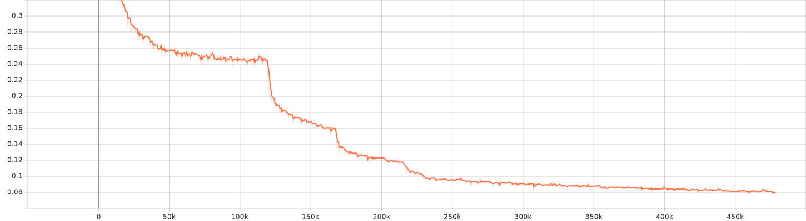

**Training Learning Rate**
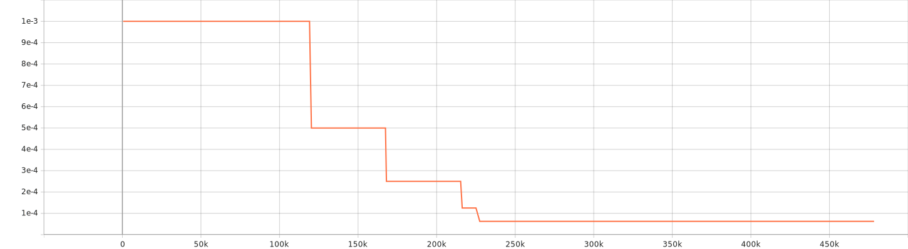  

### Accuracy Table on Testing Dataset:  

|classes                         |precisions_with_unknown|recall_with_unknown|f1 score with unknown|precisions_ignoring_unknown|recall_ignoring_unknown|f1 score ignoring unknown|
|--------------------------------|-----------------------|-------------------|---------------------|--------------------------|----------------------|------------------------|
|up                              |0.87064                |0.87436            |0.87188              |0.90531                   |0.92495               |0.91176                 |
|down                            |0.90818                |0.89107            |0.90241              |0.96283                   |0.94363               |0.95634                 |
|left                            |0.92882                |0.89198            |0.91621              |0.95917                   |0.93375               |0.95054                 |
|right                           |0.9083                 |0.91623            |0.91093              |0.94255                   |0.94509               |0.9434                  |
|stop                            |0.94143                |0.92648            |0.93639              |0.96603                   |0.96603               |0.96603                 |
|go                              |0.8842                 |0.86489            |0.87767              |0.92795                   |0.92155               |0.92581                 |
|yes                             |0.94053                |0.95853            |0.94646              |0.9593                    |0.97724               |0.9652                  |
|no                              |0.87625                |0.91127            |0.88762              |0.91346                   |0.94059               |0.92233                 |
|on                              |0.92281                |0.88329            |0.90925              |0.94265                   |0.91319               |0.93262                 |
|off                             |0.85776                |0.85702            |0.85751              |0.88131                   |0.8876                |0.8834                  |
|one                             |0.91701                |0.91852            |0.91751              |0.95303                   |0.96875               |0.95821                 |
|two                             |0.89746                |0.90683            |0.90056              |0.92998                   |0.94398               |0.9346                  |
|three                           |0.87575                |0.8609             |0.87075              |0.9486                    |0.94419               |0.94712                 |
|four                            |0.88584                |0.87532            |0.8823               |0.96089                   |0.9494                |0.95703                 |
|five                            |0.90581                |0.91481            |0.90879              |0.94369                   |0.94936               |0.94557                 |
|six                             |0.92467                |0.94262            |0.93057              |0.96045                   |0.9713                |0.96404                 |
|seven                           |0.94179                |0.9241             |0.93582              |0.97684                   |0.97202               |0.97523                 |
|eight                           |0.94374                |0.94137            |0.94295              |0.96398                   |0.95986               |0.9626                  |
|nine                            |0.9175                 |0.90842            |0.91445              |0.94669                   |0.95407               |0.94914                 |
|zero                            |0.93909                |0.8949             |0.92389              |0.97272                   |0.94532               |0.96341                 |
|UNKNOWN                         |0.92917                |0.93909            |0.93246              |                          |                      |                        |
|                                |0.91032                |0.90486            |0.9084               |0.94587                   |0.94559               |0.94572                 |
|overall accuracy with unknown   |0.9171621              |                   |                     |                          |                      |                        |
|overall accuracy ignoring unknown|0.94588                |                   |                     |                          |                      |                        |


In the above table, the last row tells the Mean of columns.
Our accuracy of classes with unknown classes is `91%`, and by ignoring the unknown class is `94%`. 


## Test Dataset Confusion Matrix:  


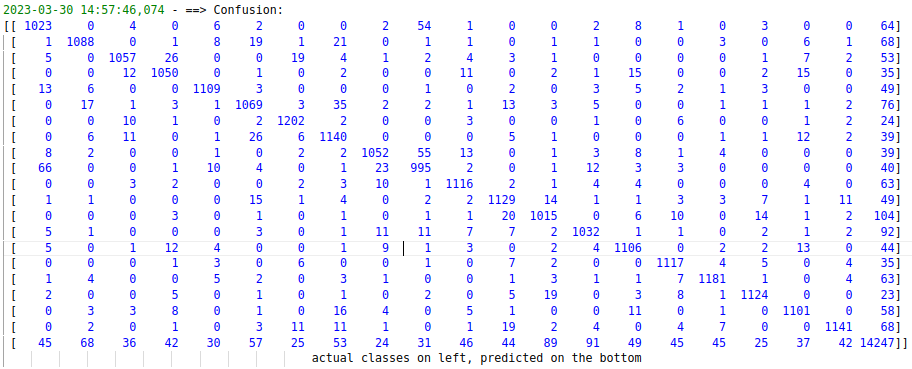


## Experiment 3:
In this, I set the weightage to the unknown class to `0`:

**Validation Top 1 Accuracy**
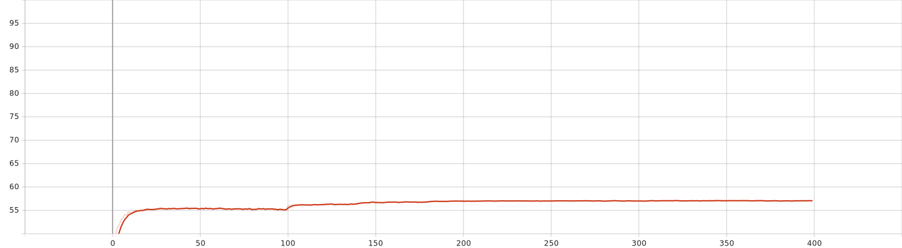

**Validation Loss**
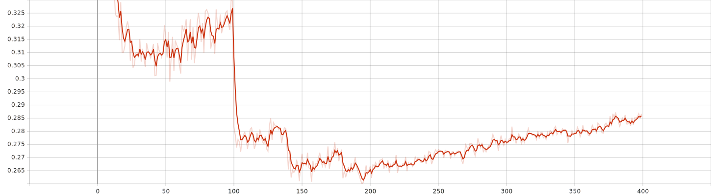


**Training Top 1 Accuracy**
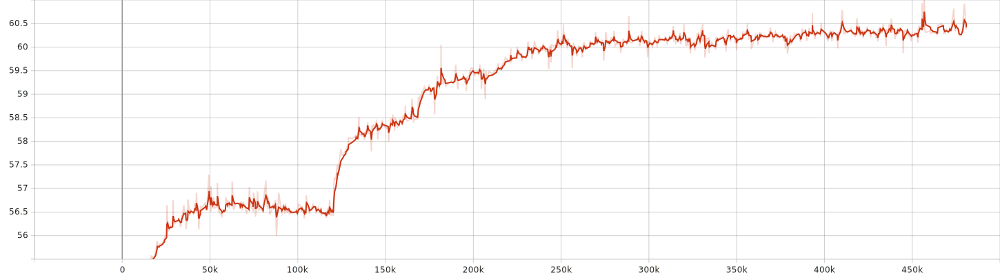


**Training Loss**
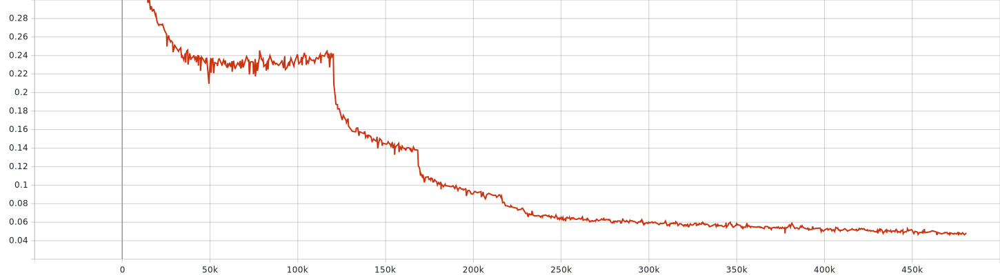

**Training Learning Rate**
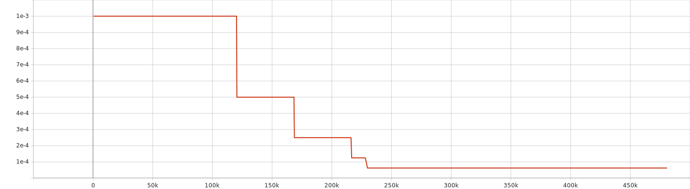  

### Accuracy Table on Testing Dataset:  

|classes                         |precisions_with_unknown|recall_with_unknown|f1 score with unknown|precisions_ignoring_unknown|recall_ignoring_unknown|f1 score ignoring unknown|
|--------------------------------|-----------------------|-------------------|---------------------|--------------------------|----------------------|------------------------|
|up                              |0.59201                |0.91573            |0.67109              |0.85714                   |0.91573               |0.87582                 |
|down                            |0.56158                |0.91431            |0.64445              |0.93761                   |0.91431               |0.92971                 |
|left                            |0.4815                 |0.90515            |0.57051              |0.92096                   |0.90515               |0.91563                 |
|right                           |0.57472                |0.87421            |0.64881              |0.93021                   |0.87421               |0.91076                 |
|stop                            |0.65209                |0.92506            |0.72323              |0.94211                   |0.92506               |0.93636                 |
|go                              |0.60785                |0.90252            |0.68209              |0.88255                   |0.90252               |0.88911                 |
|yes                             |0.71309                |0.94232            |0.77602              |0.96357                   |0.94232               |0.95638                 |
|no                              |0.65647                |0.92046            |0.72586              |0.89023                   |0.92046               |0.90009                 |
|on                              |0.73715                |0.89964            |0.78438              |0.89723                   |0.89964               |0.89803                 |
|off                             |0.59071                |0.85484            |0.65854              |0.85869                   |0.85484               |0.8574                  |
|one                             |0.52282                |0.92136            |0.6109               |0.92716                   |0.92136               |0.92522                 |
|two                             |0.75035                |0.89718            |0.79364              |0.92164                   |0.89718               |0.91334                 |
|three                           |0.44066                |0.916              |0.53283              |0.87946                   |0.916                 |0.89131                 |
|four                            |0.51531                |0.91775            |0.60353              |0.90909                   |0.91775               |0.91196                 |
|five                            |0.58567                |0.91963            |0.66633              |0.91421                   |0.91963               |0.91601                 |
|six                             |0.46129                |0.91963            |0.5532               |0.9491                    |0.91963               |0.93907                 |
|seven                           |0.36036                |0.93701            |0.45337              |0.94863                   |0.93701               |0.94472                 |
|eight                           |0.63872                |0.94353            |0.7158               |0.92583                   |0.94353               |0.93165                 |
|nine                            |0.57456                |0.91645            |0.65615              |0.90412                   |0.91645               |0.90819                 |
|zero                            |0.44486                |0.94576            |0.54023              |0.93593                   |0.94576               |0.93918                 |
|UNKNOWN                         |                       |0                  |                     |                          |                      |                        |
|        **Mean**                |0.57309                |0.87088            |0.65055              |0.91477                   |0.91443               |0.9145                  |
|overall accuracy with unknown   |0.55398385             |                   |                     |                          |                      |                        |
|overall accuracy ignoring unknown|0.914511               |                   |                     |                          |                      |                        |


In the above table, the last row tells the Mean of columns.
Our accuracy of classes with unknown classes is `55%`, and by ignoring the unknown class is `91%`. 


## Test Dataset Confusion Matrix:  


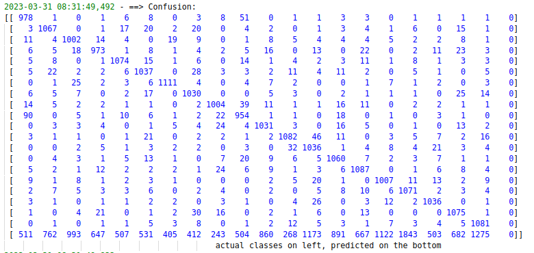

## Experiment 4: 6 keyword classification
We are now detecting six keywords and one unknown classes 

Dataset Info
```
Processing train...
Class up (# 31): 10080 elements
Class down (# 5): 10518 elements
Class left (# 15): 10239 elements
Class right (# 23): 10197 elements
Class stop (# 27): 10443 elements
Class go (# 11): 10446 elements
Class UNKNOWN: 278910 elements

Processing test...
Class up (# 31): 1089
Class down (# 5): 1233
Class left (# 15): 1164
Class right (# 23): 1137
Class stop (# 27): 1173
Class go (# 11): 1194
Class UNKNOWN: 31530
Dataset sizes:
        training=306750
        validation=34083
        test=38520
```

**Validation Top 1 Accuracy**


**Validation Loss**


**Training Top 1 Accuracy**


**Training Loss**


**Training Learning Rate**
  

### Accuracy Table on Testing Dataset:  

|classes|precisions_with_unknown|recall_with_unknown|f1 score with unknown|precisions_without_unknown|recall_without_unknown|f1 score without unknown|
|-------|-----------------------|-------------------|---------------------|--------------------------|----------------------|------------------------|
|up     |0.74311                |0.99082            |0.81067              |0.989                     |0.99815               |0.99203                 |
|down   |0.84637                |0.98297            |0.88748              |0.99671                   |0.99263               |0.99535                 |
|left   |0.83333                |0.98368            |0.87807              |0.9922                    |0.99479               |0.99306                 |
|right  |0.86146                |0.97889            |0.89734              |0.99731                   |0.99375               |0.99612                 |
|stop   |0.91176                |0.97783            |0.93277              |0.99826                   |0.98709               |0.99451                 |
|go     |0.79001                |0.9799             |0.84456              |0.98901                   |0.99659               |0.99153                 |
|UNKNOWN|0.99732                |0.95623            |0.98324              |                          |                      |                        |
|    **Mean**   |0.85477                |0.97862            |0.89059              |0.99375                   |0.99383               |0.99377                 |
|overall accuracy with unknown|0.960955|
|overall accuracy ignoring unknown| 0.993776233 |


In the above table, the last row tells the Mean of columns.
Our accuracy of classes with unknown classes is `96%`, and by ignoring the unknown class is `99%`.


## Test Dataset Confusion Matrix:  


## Experiment 5: 1 keyword classification
We are now detecting 1 keyword and one unknown 

Dataset Info
```
Processing train...
Class up (# 31): 10080 elements
Class UNKNOWN: 330753 elements

Processing test...
Class up (# 31): 1089 elements
Class UNKNOWN: 37431 elements
Dataset sizes:
        training=306750
        validation=34083
        test=38520
```

**Validation Top 1 Accuracy**


**Validation Loss**


**Training Top 1 Accuracy**


**Training Loss**


**Training Learning Rate**
  

### Accuracy Table on Testing Dataset:  

|classes|precisions_with_unknown|recall_with_unknown|f1 score with unknown|precisions_without_unknown|recall_without_unknown|f1 score without unknown|
|-------|-----------------------|-------------------|---------------------|--------------------------|----------------------|------------------------|
|up     |0.71507                |0.83196            |0.75021              |1.0                       |1.0                   |1.0                     |
|UNKNOWN|0.99509                |0.99036            |0.99351              |                          |                      |                        |
|       |0.85508                |0.91116            |0.87186              |1.0                       |1.0                   |1.0                     |
|overall accuracy with unknown|0.985877|
|overall accuracy ignoring unknown| 1.00 |


In the above table, the last row tells the Mean of columns.
Our accuracy of classes with unknown classes is `98%`, and by ignoring the unknown class is `100%`. 


## Test Dataset Confusion Matrix:  

```
==> Confusion:
[[  906   183]
 [  361 37070]]
```

## Comparing All

<span style="display: inline">
<span>
legends for below graphs<br>
<div style="display: flex;flex-direction: row;flex-wrap: nowrap;align-content: center;justify-content: flex-start;align-items: flex-end;">
        <div>
            <br>
            <svg height="20" width="20" stroke-width="0px;">
                <circle cx="10" cy="10" r="8" stroke="rgb(88, 197, 237)" stroke-width="3" fill="rgb(88, 197, 237)" outline="0px"></circle>
                Sorry, your browser does not support inline SVG.
            </svg>
            <svg height="20" width="20" stroke-width="0px;">
                <circle cx="10" cy="10" r="8" stroke="#f15a91" stroke-width="3" fill="#f15a91" outline="0px"></circle>
                Sorry, your browser does not support inline SVG.
            </svg>
            <p style="color: rgb(88, 197, 237)">Experiment 1 20 classes</p>
        </div>
        <div>
            <svg height="20" width="20" stroke-width="0px;">
                <circle cx="10" cy="10" r="8" stroke="rgb(0, 119, 187)" stroke-width="3" fill="rgb(0, 119, 187)" outline="0px"></circle>
                Sorry, your browser does not support inline SVG.
            </svg>
            <p style="color: rgb(0, 119, 187); position: relative;">Experiment 5 six classes</p>
        </div>
            <div>
                <svg style="position: relative;" height="20" width="20" stroke-width="0px;">
                    <circle cx="10" cy="10" r="8" stroke="red" stroke-width="3" fill="rgb(204, 51, 17)" outline="0px"></circle>
                    Sorry, your browser does not support inline SVG.
                </svg>
                <p style="color: rgb(204, 51, 17)">Experiment 5 binary</p>
            </div>
            </div>

**Validation Top 1 Accuracy**


**Validation Loss**


**Training Loss**


I also ran other experiments by changing different parameter, like batch, learning rate, and other parameters, but they had no serious effect on the accuracy of the model so I am not showing those graphs in this document.

## Conclusion  
The best experiment so far is experiment number 1, Our accuracy of classes with unknown classes is `93%`, and by ignoring the `unknown` class is `98%`.  
So for the final model, we can use the model of the first Experiment with `98%` accuracy ignoring the unknown, and `93%` accuracy with the unknown class 
